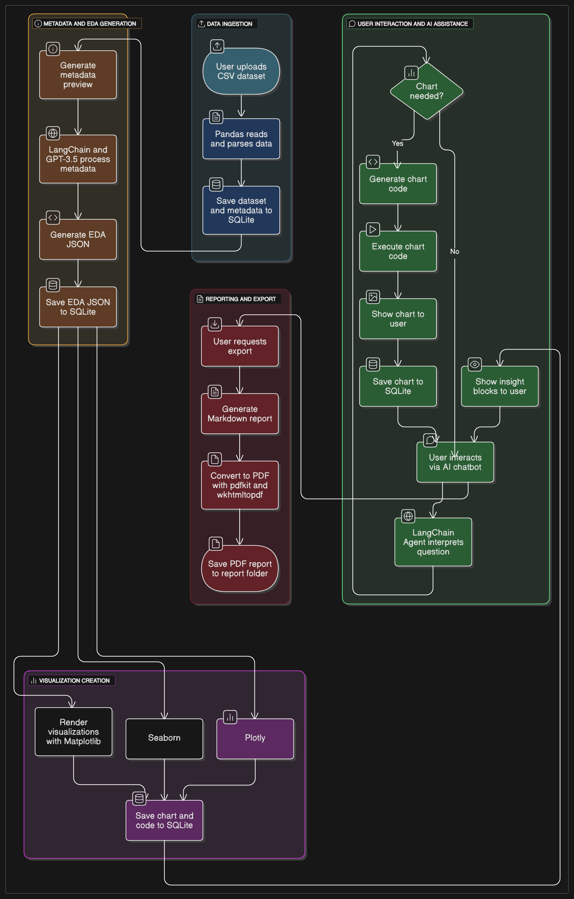

# Delight-GPT (VuDa-Chatbot-o1)

**Delight-GPT** – A Streamlit-based EDA & AI Chatbot web app for exploratory data analysis and interactive data Q&A. Upload your CSV, explore with charts, generate PDF reports, and ask the AI questions—all in one place!

For detailed architecture and explanations, please watch [architecture and functions walkthrough video on YouTube](https://www.youtube.com/watch?v=1_3ZU6xldEs)).


<div align="center">  
  
  
</div>

---

## Introduction  

Data exploration can be time-consuming and disjointed: loading CSVs, plotting histograms, tracking chart history, then switching to another tool to write up your findings. **Delight-GPT** brings it all under one roof.  

1. **Upload any CSV** via the web interface.  
2. **Visualize your data** with one-click histograms, bar charts, scatter plots, and AI-suggested “Smart Charts.”  
3. **Track & delete** previously generated charts in your history.  
4. **Generate a polished EDA report** (Markdown → PDF) without leaving the browser.  
5. **Ask questions** about your dataset in natural language—the AI’s got you covered.

Built with Streamlit, a lightweight FastAPI backend, and an external LLM (e.g. OpenAI’s GPT-3.5), Delight-GPT streamlines your entire EDA workflow.

---

## Models & Technologies  

1. **Data & Plotting**  
   - **Pandas & NumPy** for data manipulation.  
   - **Matplotlib** for rendering charts in Streamlit.  

2. **AI & LLM Integration**  
   - **OpenAI GPT-3.5-turbo** via our `llms.py` wrapper.  
   - **Smart Chart Prompts** craft chart specifications automatically.  

3. **Web & Backend**  
   - **Streamlit** for the single-page UI & sidebar navigation.  
   - **FastAPI** (optional) for future API extensions.  
   - **SQLite** for event logging, upload metadata, and chat history.  

4. **Utilities**  
   - Custom **`utils.py`**: CSV I/O, plotting helpers, report export.  
   - **Logging Service** (`logger/base.py`): Centralized event capture.  

---

## Pipeline & Architecture  

<div align="center">  

    
  *Modular architecture with pages, utils, LLM wrapper, and DB*  
</div>

---

## UI & Key Functions  

- **Dashboard** – Overview of all uploaded datasets.  
- **Dataset Details** – Column-level stats, missing data, outlier detection.
- **Delight Chatbot** – A RAG-based chatbot to be asked anything about your own data.
    <div align="center">  
  
      
    </div>

    <div align="center">  
  
      
    </div>

    
- **Charts History** – Review & delete past charts with a click.
  <div align="center">  
  
    
  </div>
- **EDA Report** – One-click Markdown/PDF summary export.
  <div align="center">  
  
    
  </div>
- **Smart Charts** – AI-driven chart recommendations & generation.
  <div align="center">  
  
    
  </div>
- **About Project** – Credits, links & documentation.


---

## About Installation & Configuration

### 1. Prerequisites:
- Python 3.8+
- Git

### 2. Clone the Repository

```bash
git clone https://github.com/PrORain-HCMUS/VuDa-Chatbot-o1.git
cd VuDa-Chatbot-o1
```

### 3. Install dependencies:
```bash
pip install -r requirements.txt
```

### 4. Configure LLM settings:
Create a .env file and add your OpenAI key:
```bash
echo "OPENAI_API_KEY=your_api_key_here" > .env
```
(Make sure .env is listed in .gitignore to keep your key private)

 
### 5. Launch the app:
```bash
streamlit run main.py
```

After launch, open your browser at http://localhost:8501 to start using Delight-GPT!


---

